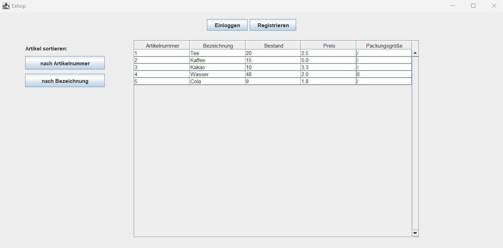
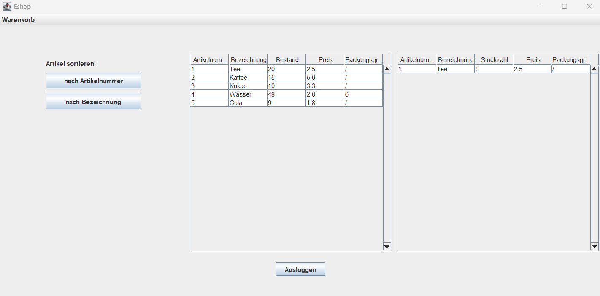
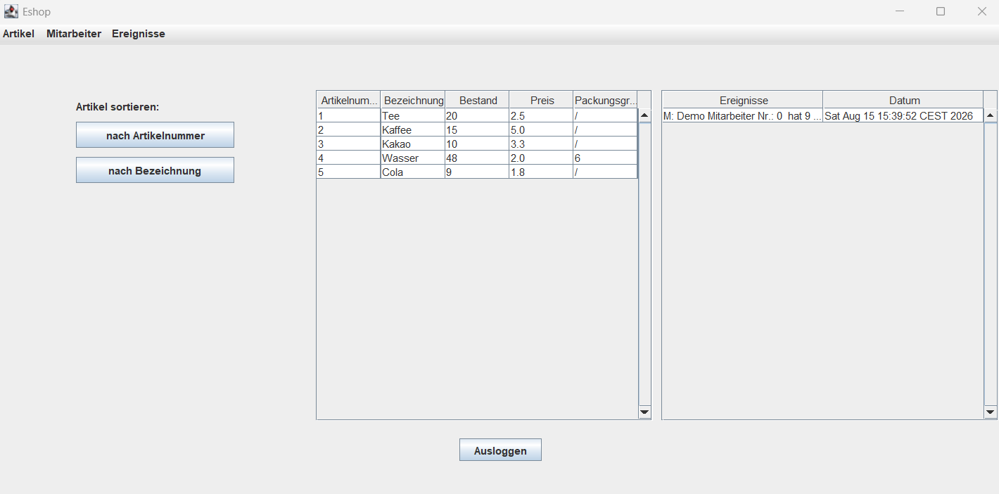

# Java eShop – Client/Server Shop System

A desktop-based shop management system developed in Java as part of the Programming 2 course during the second semester of my Computer Science studies.

The project was developed in a team of three. It evolved iteratively from a command-line application into a graphical client/server application.

The application supports product and inventory management, customer and employee accounts, shopping carts, purchases, invoice generation, persistent data storage, and socket-based client/server communication.

## Technologies

- **Language:** Java
- **GUI:** Java Swing
- **Architecture:** Layered architecture (GUI, domain logic, persistence, common/shared module)
- **Networking:** Java Sockets / Client-Server architecture
- **Concurrency:** Multi-threaded server-side client request processing
- **Persistence:** Java Object Serialization

## Architecture

The application follows a layered architecture and is separated into three modules:

- **Client module**
    - Java Swing graphical user interface
    - Client-side implementation of the shop interface
    - Translates GUI actions into socket requests

- **Server module**
    - Domain logic and business rules
    - Persistent data handling
    - Socket server and request processing
    - Processes each client connection in a separate thread

- **Common module**
    - Shared interface (`IEShop`)
    - Shared value objects and domain data types
    - Shared custom exception classes

## Features

### User and Product Management

- Customer registration, employee registration through the employee interface, login, and logout
- Separate customer and employee interfaces
- Create and manage products with unique product numbers
- Display products sorted by name or product number
- Increase inventory through employee actions
- Support for single items and bulk goods with package-size validation

### Shopping and Orders

- Add products to a shopping cart
- Change quantities, remove products, or clear the shopping cart
- Complete purchases and automatically update inventory
- Generate invoices with purchased products, quantities, prices, and total price

### Inventory Events and Validation

- Record inventory-related events for incoming stock and purchases
- Display and filter events by product
- Sort events by date
- Custom exceptions and user-friendly error messages for invalid operations

### Persistence and Client/Server Communication

- Persist products, users, and inventory events using Java Object Serialization
- Automatically initialize demo data on the first start
- Central server-side domain logic and persistence
- Socket-based communication between the Swing client and server
- Separate server-side thread for each client connection

## Screenshots

### Initial Area


### Customer Area


### Employee Area


## My Contribution

As part of the three-person project team, I was mainly responsible for:

- Designing and implementing parts of the Java Swing user interface
- Implementing persistence with Java Object Serialization
- Implementing parts of the client-side socket communication
- Developing parts of the shopping cart and purchase workflow
- Contributing to the domain model and exception handling
- Supporting integration, testing, debugging, and project coordination

We worked collaboratively across the different application layers and supported each other throughout development.

## Prerequisites

To run the project locally, the following tools are required:

- Java Development Kit (JDK) 17 or newer
- IntelliJ IDEA or another Java IDE

## Installation and Running the Project

### 1. Clone the repository

```bash
git clone https://github.com/<your-username>/java-eshop-client-server.git
cd java-eshop-client-server
```

### 2. Open the project

Open the project folder in a Java IDE. IntelliJ IDEA is recommended because the project was originally developed using IntelliJ modules. The project consists of the following modules:

```text
Client
Common
Server
```

### 3. Start the server

Start the following main class first:

```text
net.EShopServer
```

Expected console output:

```text
Server läuft und wartet auf eingehende Verbindungen!
```

### 4. Start the graphical client

While the server is running, start:

```text
ui.gui.EshopGUI
```

A Java Swing window should open and connect to the local server.

### 5. Start additional clients (optional)

To test multiple client connections, start `ui.gui.EshopGUI` again while the server is running.

Each GUI instance establishes a separate socket connection to the central server.

## Demo Accounts

On the first start, the application automatically creates local demo data.

| Role     | User ID | Password  |
|----------|---------|-----------|
| Employee | `0`     | `demo123` |
| Customer | `1`     | `demo123` |


## Local Data

Runtime data is stored locally in the `data/` directory and is excluded from version control.

To reset the application to its initial demo state, stop the server and all clients and delete the directory.

For macOS/Linux:

```bash
rm -rf data
```

For Windows PowerShell:

```powershell
Remove-Item -Recurse -Force .\data
```
Demo data will be created again the next time the application is started.


